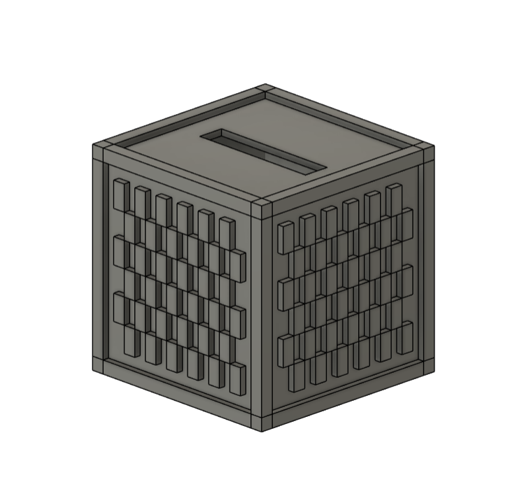
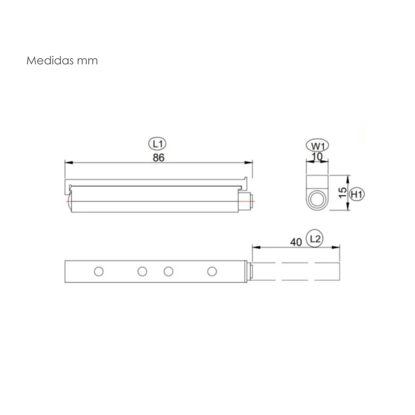
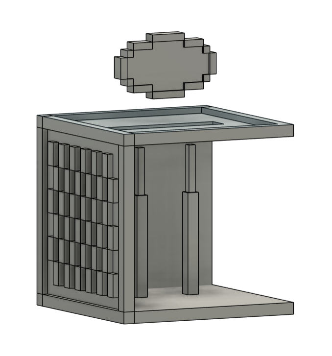

# June 13: Brainstorming (~2 Hours)

I got inspired by the jukebox that was made and wanted to try and make my own with more features. One thing I had in mind was to have disks that have specific "prompts" encoded in the NFC tags to play music generated through Sumo from the prompt. Then I also wanted to have album-like disks where they play an album from spotify or something. Also a push-push mechanism for the disks as I think that feature would be satisfying to put in/take out the disks. I plan on making the frame from blocks of wood and then the insides with a combination of 3D printed parts. I would like to be able to place a speaker inside or for it to be able to connect to a speaker with aux/bluetooth.

# June 14: More Brainstorming and Case Design (~7 Hours)

I was looking into the different types of wood finishes as I wanted a jukebox that looked nice on the outside (the inside aswell) so I researched the wood types that I wanted to buy. For the border, I wanted an ebony or other dark wood, for the sides, I'm thinking about using a red mahogany/black walnut mix to create texture, and for the rest of the sides, maybe cherry wood.

I also worked on the case in Fusion360, it is going to be a cube thats 16x16x16cm.

I also bought 2 "push push" cabinet mechanisms at my local hardware store to use for the disk. They are a bit strong so it will have enough force to literally "eject" the disk.

# June 15: Disc Design and Slot (~6 Hours)

I started design on the disk design and the slot in which the disks were going to be pushed into, keeping in mind the dimensions for the 2 push push mechanisms.

I added in the 2 push mechanisms in to the bog to discover that they fit perfectly

Obviously there is going to be a "guide" for the disk so that it doesn't get jammed, I'll add the nfc tag reader to the side.

After that I added a hole for the speaker and the cables for the Raspberry Pi.

# June 16: Connections (~6 Hours)

I went to the center of my city to try and find ebony but I had to leave because it is a semi dangerous place and I felt unsafe. I plan on returning with my mom to see if we can find it but for now I plan on ordering cubes on Temu and painting/staining them.

After making the box I fired up KiCad to connct the components, following a [tutorial](https://pimylifeup.com/raspberry-pi-rfid-rc522/) to connect the NFC reader to the Raspberry Pi and also a [guide by Adafruit](https://learn.adafruit.com/adafruit-max98357-i2s-class-d-mono-amp/raspberry-pi-wiring) for the amp wiring.

# Future Work

When the cubes come in, I will have to paint each one and then cut, sand, and glue them together. After I plan on applying a finish to make the box look good. I think this will take a few days to up to a week.
